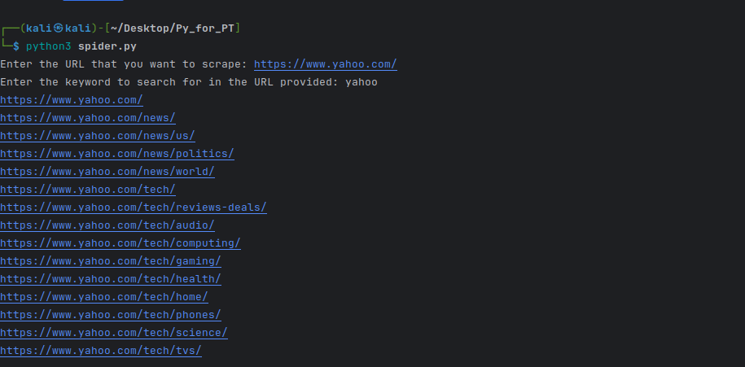

# Python for Penetration Testing
## Description:
  This project is made to penetration testing in order to exeaming there test exploit with python code 
### Fuzzy.py Script Description:
**Info:**
This python script preform Fuzz after the "/" in target URL
>1. Create your own word list in txt file 
>2. Open a terminal and run the command:
```
pip install -r requirements.txt
cat wordlist.txt | python3 fuzzy.py
```
### Spider.py Script Description:
**Info:**
The spider script is a Python program designed to crawl web pages recursively starting from a given URL. It searches for URLs containing a specified keyword and prints them to the console. Additionally, it stores these URLs in a file named urls.txt. The spider script utilizes the requests library to make HTTP requests, BeautifulSoup for HTML parsing, and urljoin to resolve relative URLs. It maintains a set of visited URLs to avoid revisiting the same pages. The script is suitable for web scraping tasks where the goal is to extract URLs containing specific keywords.
>**Spider Script Manual Guide:**
Ensure you have Python installed on your system. If not, download and install Python from the official website: [Python Downloads](https://www.python.org/downloads/).
Clone or download the spider script (spider.py) from this repository.
Open a terminal or command prompt.
Run the spider script by executing the following command:
```
pip install -r requirements.txt
python spider.py
```

Follow the prompts to input the URL you want to scrape and the keyword you want to search for.
The script will start crawling the provided URL, searching for the specified keyword, and print the URLs containing the keyword to the console. Additionally, it will save these URLs to a file named urls.txt.

### Prob Script Description:
**Info:**
The prob script is a Python program that filters URLs based on their response status codes. It reads a list of URLs from standard input, sends HEAD requests to each URL, and selects only those with a status code of 200 or 403. The script handles various error scenarios gracefully, such as URLs with missing schema or connection errors. It outputs the filtered URLs to a file named filtered_urls.txt. The prob script is useful for validating URLs and selecting only those that are accessible and responsive.
>**Prob Script Manual Guide:**
Create a file named urls.txt containing the list of URLs you want to filter. Each URL should be on a separate line.
Open a terminal or command prompt.
Run the prob script by executing the following command:
```
pip install -r requirements.txt
cat urls.txt | python prob.py
```
This command pipes the contents of urls.txt to the prob script.
The script will filter the URLs based on their response status codes, selecting only those with a status code of 200 or 403. It will then save the filtered URLs to a file named filtered_urls.txt.

### amazon_price_checker.py Description:
**Info:**
The amazon_price_checker.py script is a Python program designed to monitor the price of a specific product on Amazon. It utilizes web scraping techniques through the Selenium library to extract the current price of the product from its Amazon page. The script is configured to run once a day at 08:00 and checks whether the price of the product has fallen below a predefined threshold, in this case, $30.

If the price is indeed lower than $30, the script sends an email notification to the specified recipient using SMTP. To enable email notifications, the user must provide valid sender and receiver email addresses, as well as an app password for the sender's email account (if using Gmail) stored as an environment variable.

The purpose of the script is to automate the process of monitoring product prices on Amazon, allowing users to take advantage of price drops without needing to manually check the website themselves.

>**Amazon Price Checker Script Manual Guide**
Installation:

Download the amazon_price_checker.py script to your computer.

2. ChromeDriver Installation:
Download ChromeDriver compatible with your Chrome browser version from the official ChromeDriver downloads page.
Extract the downloaded ChromeDriver executable file.
Place the extracted ChromeDriver executable in a directory included in your system's PATH environment variable to ensure it's accessible from anywhere.

3. Configuration:
Open the amazon_price_checker.py script in a text editor.
Replace 'thesenderemail@gmail.com' with your Gmail email address in the send_mail() function.
Replace 'thereceiveremail@gmail.com' with the email address where you want to receive notifications.
Set up an app password for your Gmail account by following these steps:
Go to your Google Account settings.
Navigate to the "Security" section.
Under "Signing in to Google," select "App passwords."
Generate an app password for the amazon_price_checker.py script and copy it.
Set the EMAIL_PASSWORD environment variable in your system to the generated app password.

4. Execution:
Open a terminal or command prompt.
Navigate to the directory where the amazon_price_checker.py script is located.
Run the script by executing the following command:
Copy code
python amazon_price_checker.py

5. Usage:
The script will run once a day at 08:00 local time.
It will check the price of the specified product on Amazon.
If the price drops below $30, an email notification will be sent to the specified recipient.

6. Troubleshooting:
If you encounter any errors, double-check the configuration settings, including email addresses and app password.
Ensure that the EMAIL_PASSWORD environment variable is correctly set.
Check your internet connection and verify that the product URL in the script is correct and accessible.
Make sure ChromeDriver is properly installed and accessible from your system's PATH.

7. Customization:
You can modify the product URL in the script to monitor the price of a different product on Amazon.
Adjust the price threshold ($30 in the script) to your desired value.

8. Maintenance:
Periodically check the script for updates or changes in Amazon's website structure that may affect its functionality.
Update the script accordingly if there are any changes.

9. Disclaimer:
Use the script responsibly and in accordance with Amazon's terms of service.
The script is provided as-is, and the developer is not responsible for any misuse or unintended consequences.
